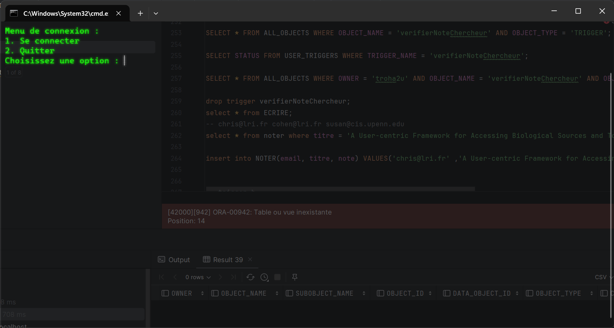
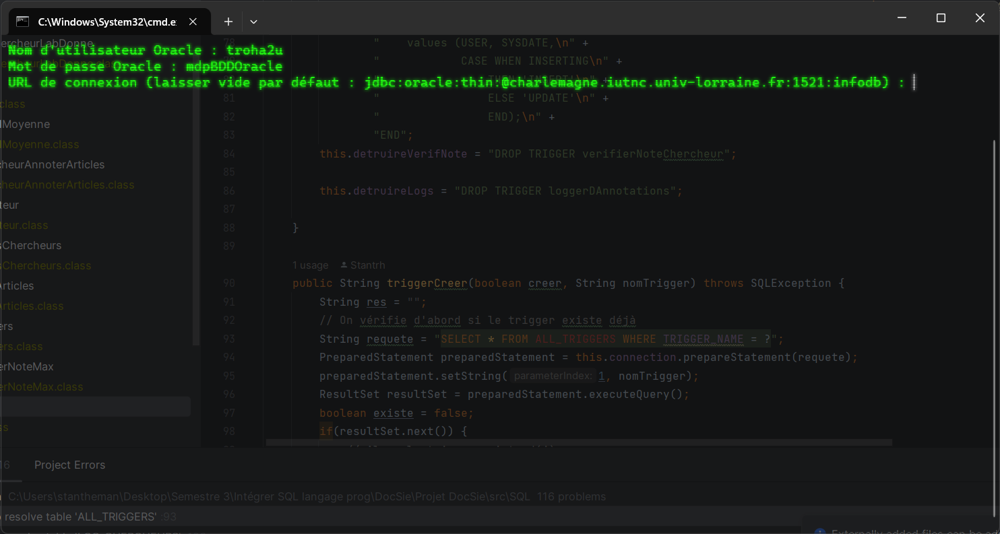
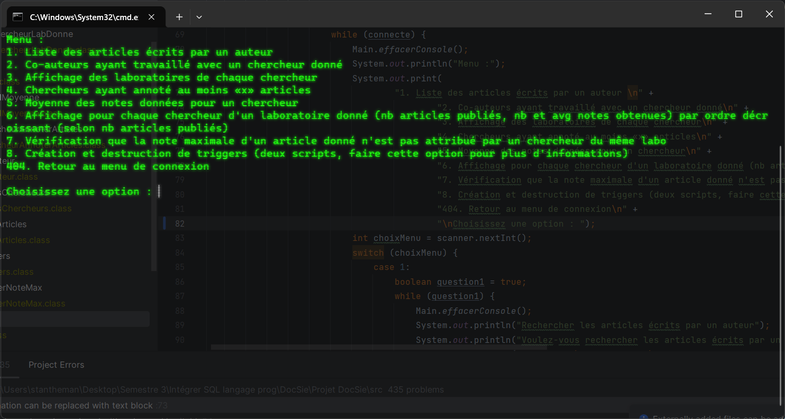
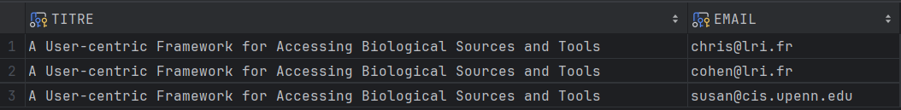
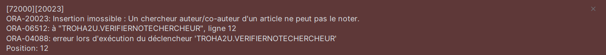
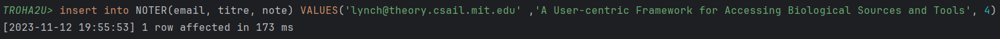
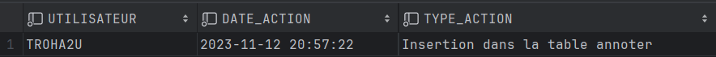

# [TP Final DocSie](/)

## Architecture de mon projet entièrement en JAVA : 
J'ai décidé de : 
- faire un menu interactif permettant de naviguer entre chaque fonctionnalité   
- faire de chaque fonctionnalité une classe Java pour faciliter la compréhension du code et surtout le main de la classe principale (qui est déjà très volumineux)  

Je l'ai réalisé sous IntelliJ Idea ULTIMATE  
L'entièreté du projet est disponible, mais pour le lancer je recommande d'ouvrir un invité de commande dans [src/](/src)  
Puis d'exécuter cet enchaînement de commandes :  
`javac main.java && java -cp ../ojdbc11.jar;. Main`

Car si on lance le Main depuis le projet intelliJ, le rafraichissement de la console ne fonctionne pas, et c'est moins pratique de savoir à quelle étape on en est.

Au lancement du programme on obtient : 

On renseigne ses identifiants :

On arrive sur le menu proposant les différentes fonctionnalités : 

## Problèmes rencontrés : 
J'ai cependant rencontré un problème lors de la programmation des triggers.
Pour des raisons de cohérence, j'ai décidé de vérifier si le trigger existait avant d'essayer de le détruire/créer.
J'avais déjà réussi à effectuer cette vérification sur une base de données oracle locale, mais je n'ai pas réussi sur la base de données troha2u
En exécutant ces requêtes :  
`SELECT * FROM ALL_OBJECTS WHERE OBJECT_NAME = 'verifierNoteChercheur' AND OBJECT_TYPE = 'TRIGGER';`  
`SELECT STATUS FROM USER_TRIGGERS WHERE TRIGGER_NAME = 'verifierNoteChercheur';`  
`SELECT * FROM ALL_OBJECTS WHERE OWNER = 'troha2u' AND OBJECT_NAME = 'verifierNoteChercheur' AND OBJECT_TYPE = 'TRIGGER';`  
On doit se voir retourner le trigger en question, mais même après les avoir bien créés et vérifier qu'ils existent, rien ne m'est retourné.
C'est pour cela que le code concernant les triggers fonctionne partiellement, même si leur création/déletion fonctionnent parfaitement.

**Pour le premier trigger : ** 
J'ai choisi de travailler avec l'exemple de l'article "A User-centric Framework for Accessing Biological Sources and Tools" écrit par :  

Voici un exemple pour le premier trigger concernant le fait qu'un chercheur ayant écrit un article ne puisse pas le noter :  
- `insert into NOTER(email, titre, note) VALUES('chris@lri.fr' ,'A User-centric Framework for Accessing Biological Sources and Tools', 4);`  
On essaye d'ajouter une note à un article co-écrit par chris@lri.fr avec son email, voici ce qui nous est retourné :  
    
- `insert into NOTER(email, titre, note) VALUES('lynch@theory.csail.mit.edu' ,'A User-centric Framework for Accessing Biological Sources and Tools', 4);`  
On essaye maintenant d'ajouter une note à un article donc le chercheur attribuant la note n'est pas un co-auteur, on obtient pas d'erreur et cela fonctionne :  
  

**Pour le deuxième trigger : **
Voici un exemple de son utilisation :  
On effectue une action dans la table Annoter :  
`insert into ANNOTER(email, titre, libelle) VALUES ('lynch@theory.csail.mit.edu', 'The TLA+ Proof System: Building a Heterogeneous Verification Platform', 'Concurrency');`
  
Et si on regarde maintenant ce que notre table log_chercheurs contient :  
  

Ainsi, le trigger fonctionne bien !

### Packages utilisés :
- J'ai utilisé la classe [Scanner](https://docs.oracle.com/javase/8/docs/api/java/util/Scanner.html) du package [java.util](https://docs.oracle.com/javase/8/docs/api/java/util/package-summary.html) pour pouvoir rendre le menu interactif et permettre à l'utilisateur de renseigner des champs (comme les emails des chercheurs, l'option associée à la fonctionnalité choisie)  
- J'ai utilisé le driver [JDBC oracle v11](https://download.oracle.com/otn-pub/otn_software/jdbc/233/ojdbc11.jar) pour la relation entre mon code java et la base de données Oracle.

